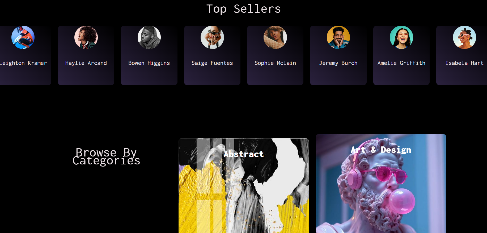

## AI-ART APPLICATION

The idea for this application was to create an online store where you can buy and sell unique images that will be generated with text using AI intelligence. To enable this, we used Stability.ai's API, Stability Image Ultra. Our application distinguishes two types of users, guests and registered users. Both are allowed to view products and make purchases.
Registered users can also generate their own images and put them up for sale, which in some way will make them artist. After the image has been successfully generated, the user should select a category for it that describes it and specify a price at which the image would be sold. If an image is purchased, the user will earn 95% of the price of the image.

## This project was made by group of programming students at Qinshift Academy

Back-end was made in C#, in .NET framework, by the student Spase Naumovski.
Front-end was made in JavaScript, in Angular framework by:

1. Ana Mihajlovska - Home page, Account page and UI/UX on Register and Login pages
2. Kiril Lisickov -Creator of the original idea of ​​the project, worked on Contact page with implementing the Web3Forms API
3. Aleksandar Strezovski - About page
4. Pavel Gjorgjievski - Register and Login pages, worked together with Aleksandar Strezovski
5. Tamara Najdovska - Team lead of the project, worked on Categories, Cart, Favorites and Generate your art pages

Mentor of this project was Aneta Stankovska, mentor at QinShift Academy.

## How to run the server

1. Open folder Server/ArtShop file ArtShop.sln i Visual Studio
2. In Visual Studio open ArtShop.APi / Connected Services / Secrets.json,
3. Open the SQL Server and copy you server name
4. Go back to Visual studio and paste the server name you copied in the Connection String, for the value for ArtShopDBContext for Server only.
5. Open Tools in navigation bar in Visual Studio, then NuGetPackage Manager and Package manager console, ofter opening the console, change the Default Project to be ArtShop.DataAccess
6. Run add-migration createDatabase
7. Run update-database
8. Open the file ArtImageService.cs, find var jsonPath and replace the value with the location of the images.json file which you downloaded with the project
9. Click on http to run the server

## Using the server

1. Register user with userName AiArt, and e-mail aiArt@mail.com and login the user
2. Go on the endpoint importImages

## How to run the web

1. Go on https://platform.stability.ai/account/keys to create and copy the API key
2. Open folder AiArt in Visual Studio Code, find the file environments.ts, replace the value for STABILITY_KEY with you new API key and save the file
3. npm install
4. npm start
5. Open the link in browser

## Images from application

